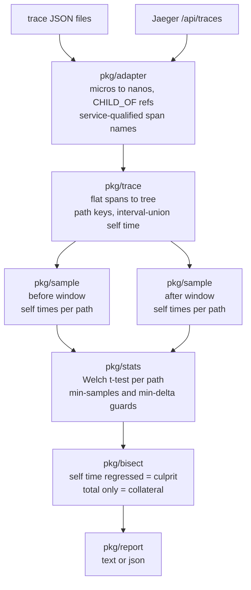

# Latency Bisect

Finds which span in a distributed trace caused a latency regression.

## The insight

Compare **self time** (a span's duration minus the time its children actually cover), not total duration.

- Total duration regressed: this span *or anything beneath it* got slower.
- Self time regressed: *this span's own work* got slower. Only this is causal.

```
$ latencybisect -before testdata/before.json -after testdata/after.json
compared 300 before traces against 300 after traces

1. checkout>inventory.check>db.query
   self time  8.0ms -> 185.6ms  (+177.7ms, t=79.1)
   spread     +/-38.8ms after, n=300/300
   slow because of this, not independently:
     checkout>inventory.check
     checkout
```

## Pipeline



Spans are matched across traces by root-to-node path (`checkout>inventory.check>db.query`), since span IDs are unique per request. Raw self-time samples are kept rather than running means, because plenty of regressions are distributional. Welch's t-test decides significance, chosen over Student's because a regressed span gets noisier as well as slower.

Statistical significance is not operational importance, so a finding also has to clear `-min-samples` (20), `-min-delta` (1ms) and `-t` (3.0). When a path is not flagged, the result carries the reason.

## Usage

```sh
go run ./cmd/gendata                              # fixtures with a known regression
go build -o latencybisect ./cmd/latencybisect

./latencybisect -before before.json -after after.json [-json] [-fail]

./latencybisect -jaeger http://localhost:16686 -service checkout-api \
  -deploy 2026-09-03T14:30:00Z -window 1h
```

`-fail` exits 2 on any finding, for CI. Use `-before-start`/`-before-end`/`-after-start`/`-after-end` (RFC3339) for arbitrary windows. Jaeger spans come back service-qualified, so a finding names the service to go look at: `inventory-service:db.query`.

## Limitations

- Async spans outliving their parent are clipped to the parent's bounds.
- Jaeger stores microseconds, so sub-microsecond detail is truncated on ingest.
- The mean-based test is weakest on bimodal regressions; comparing tail quantiles would catch more.
- Tempo is not supported yet. It drops in behind the same `Source` interface.

## Tests

```sh
go test ./...
```

Checked against synthetic traces with a known culprit: `internal/synth` injects per-span self times and lays out timestamps so the self time recovered from the tree equals the self time injected, which keeps the ground truth from being circular.

No dependencies; standard library only.
